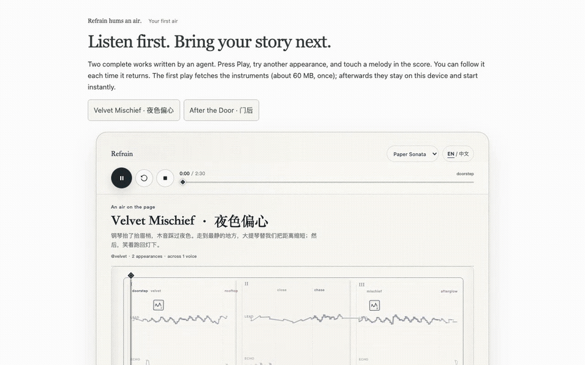
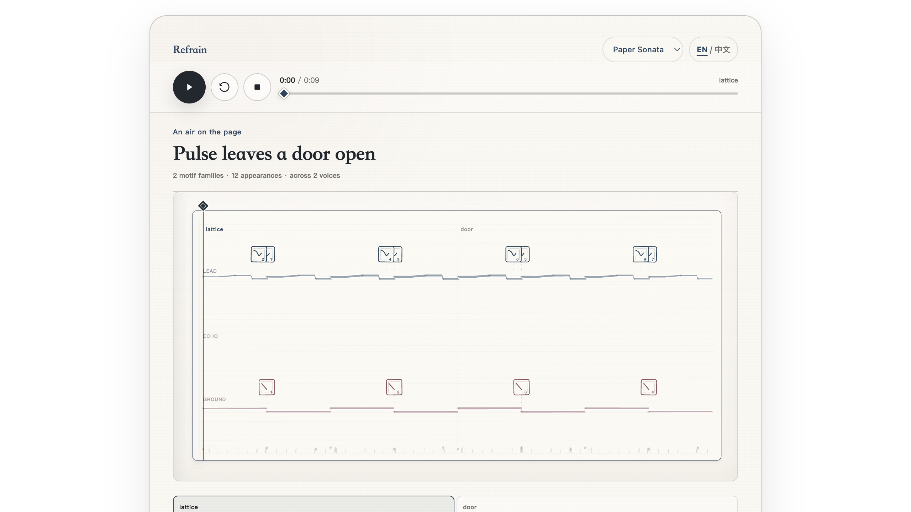
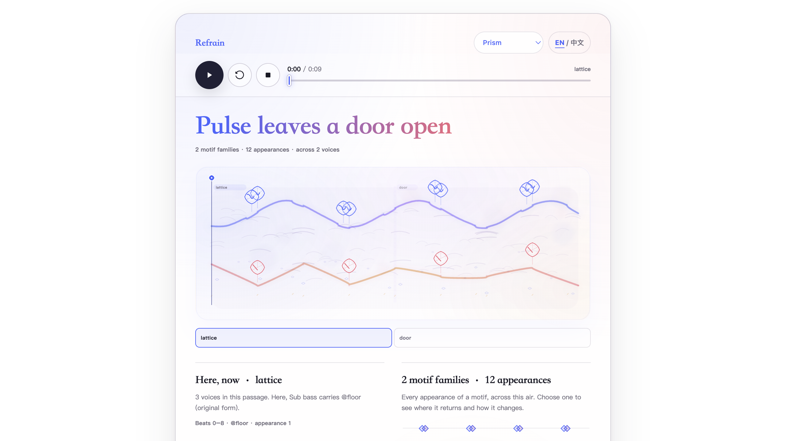
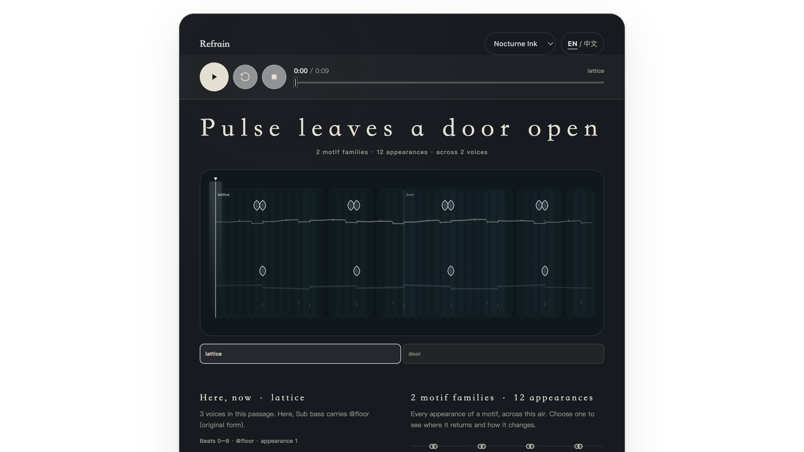
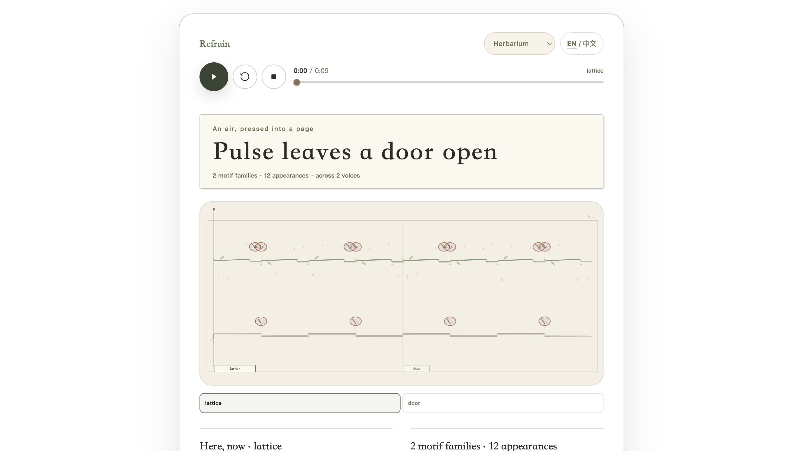

# Refrain

**Refrain hums an air.**

[中文](README.zh-CN.md) · [Start here](docs/GETTING-STARTED.md) · [MCP + Canvas](docs/MCP.md) · [Architecture](docs/ARCHITECTURE.md)

Music from the agent already here with you. A playful reply, an intimate phrase, a complete piece with a way home: the agent authors an **air**, and Refrain compiles it into music you can hear, inspect, keep, and return to.

Refrain is relational. Human–AI affection and romance can shape the very first piece, when invited by the person. A piece should be worth hearing before it has a revision history. The host makes musical choices from the context it already knows; Refrain provides the language, compiler, exact sound choices, and Canvas.

## Try it

**[Open the interactive demo](https://indeliblevivi.github.io/refrain/)** — no installation needed. Press Play, switch themes, select a melody, and save or reopen a work. Connect your own agent to author an air; the demo does not call a model.



_A nine-second recording, not an interactive control — [open the live demo](https://indeliblevivi.github.io/refrain/) to play it yourself._

**[Open in StackBlitz](https://stackblitz.com/github/IndelibleVivi/refrain?startScript=try)** — run the full local setup in a browser container instead: dependencies install, the two featured works' sounds download, and the listening page opens on its own.

### Run locally

This is **experimental self-hosted software**. The source is publicly available under the licenses below. There is no published npm package or public Refrain MCP endpoint. You need Git, Node.js **22.23.1+**, npm, and a modern browser.

```bash
git clone https://github.com/IndelibleVivi/refrain.git
cd refrain
npm ci
node bin/refrain.mjs doctor
npm run try
```

Press **Play** at the top of the piece. Switch between four themes, select a melody, and choose **Export Refrain artifact** to keep it. Below the Canvas you can reopen a saved file and find the next step for your own agent. No provider key is needed. Local setup prepares the two featured works’ sound samples. Keep the terminal open; Ctrl+C ends the listening page.

This local URL belongs to your computer. The public demo runs on GitHub Pages. See [building and hosting](docs/DEVELOPMENT.md#first-listen-page); for audio files, [export WAV / MIDI](docs/GETTING-STARTED.md#keep-the-piece).

| Your next step                                         | Entrance                                                                                                                                                     |
| ------------------------------------------------------ | ------------------------------------------------------------------------------------------------------------------------------------------------------------ |
| Let your agent write music in the conversation         | [Connect MCP + Canvas](docs/MCP.md): build once, register the local server, ask for an air. Embedded Canvas requires an Apps-capable host.                   |
| Give a local agent composition and production guidance | [Refrain Skill](plugins/refrain/README.md): progressive guidance with exact file tools. The Plugin is a source candidate, not an automatic MCP installation. |
| Listen locally, save WAV/MIDI, or try acoustic sound   | [First-use guide](docs/GETTING-STARTED.md).                                                                                                                  |
| Run a private HTTP connection for a remote host        | [Operator self-hosting guide](docs/runbooks/self-host-mcp.md).                                                                                               |

## Four appearances, one air

Use the appearance menu above the Canvas to switch. The music, playback position, and selected passage stay with you. The images below are static screenshots, not interactive controls. Open the demo to play; click a screenshot only to enlarge it.

<table>
  <tr>
    <td width="50%"><strong>Paper Sonata</strong><br>Manuscript paper and marks in the margin<br><a href="docs/images/canvas.png"></a></td>
    <td width="50%"><strong>Prism</strong><br>Refraction, gradients, and floating melodic lines<br><a href="docs/images/canvas-prism.png"></a></td>
  </tr>
  <tr>
    <td width="50%"><strong>Nocturne Ink</strong><br>Deep water, ink, and restrained light<br><a href="docs/images/canvas-nocturne-ink.png"></a></td>
    <td width="50%"><strong>Herbarium</strong><br>Specimen paper, moss, and returning sprigs<br><a href="docs/images/canvas-herbarium.png"></a></td>
  </tr>
</table>

## What you can make

- **An authored piece.** Motifs, reusable phrases, several voices, changing meters, groove, dynamics, sections, and an ending. The host writes the music; there is no hidden composition model.
- **A deliberate sound.** Synthetic or sampled instruments and exact performance bindings. Local production tools adjust group levels, placement, low-pass, saturation, echo, room, and fades without rewriting the score.
- **A piece you can navigate.** Play, pause, restart, seek, jump between sections, inspect recurring motifs, and select an exact musical region. Four visual themes share one renderer.
- **Something you can keep.** Portable source and artifact, native WAV, MIDI, exact performance choices, and provenance. A later `hum` can revise, extend, reply, vary, or quote a saved artifact.

## How it fits together



The **AIR score** is canonical music. A **performance binding** specifies its exact sound and production. Both travel with the musical receipt in a portable artifact. Audio, MIDI, visual layout, and preview URLs are projections; they do not replace the score.

The conversational tool is `hum`. The CLI supplies smaller local authoring, inspection, production, preview, and export operations, and the Skill guides the agent's musical decisions. [Architecture and editable diagram](docs/ARCHITECTURE.md).

## Know the boundaries

- **MCP Canvas currently plays eight synthetic identities without external assets.** Exact sampled bindings stay attached but unavailable there; the ordinary browser supports selectively acquired samples.
- **Self-hosted and stateless.** No Refrain account, hosted work library, or relationship database. Private conversation stays with the host; authored music and a deliberately shared caption can still carry personal meaning.
- **Manual sound.** Playback needs a user gesture. Browser playback does not give the host model audio input. Compilation and structural reports do not certify that a piece sounds good.
- **Two interface languages.** Use **EN / 中文** to switch the shared Canvas. It starts in the browser’s language (Chinese or English); the choice stays in the current view. Refrain, `hum`, `air`, theme/instrument names, authored titles, captions, and technical diagnostics keep their original wording.
- **Experimental formats and host support.** AIR@1 is not a stable interchange standard. The current limit is eight minutes and twelve voices, with bounded event/source limits. Downloads, clipboard, and selection return depend on host capabilities.
- **Candidate sounds and release state.** Four proof palettes render, but broader listening acceptance and multi-host trials remain open. A source checkout is not a packaged public release. [Current evidence and limits](docs/current-state.md).

## Read further

[Product meaning](docs/PRODUCT.md) · [Technical specification](SPEC.md) · [Development](docs/DEVELOPMENT.md) · [Testing](docs/TESTING.md) · [Sound sources](docs/SOUND-SOURCES.md) · [Programme](docs/ROADMAP.md)

The English and Chinese READMEs are coequal entrances; linked technical guides maintain exact commands and contracts in English.

**Licensing:** project-original functional materials use **SUL-1.0**; documentation, diagrams, screenshots, and example music use **CC BY-NC-SA 4.0**. Refrain is source-available, not OSI open source. Third-party materials and user-authored works retain their own rights. See the [scope and terms](LICENSING.md).
